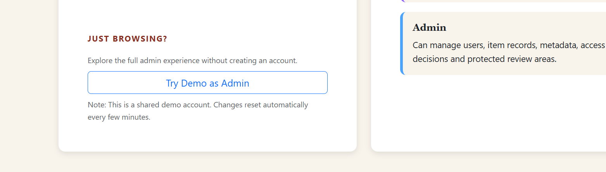
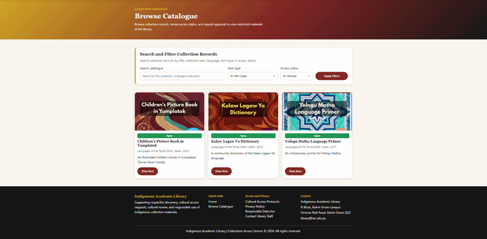
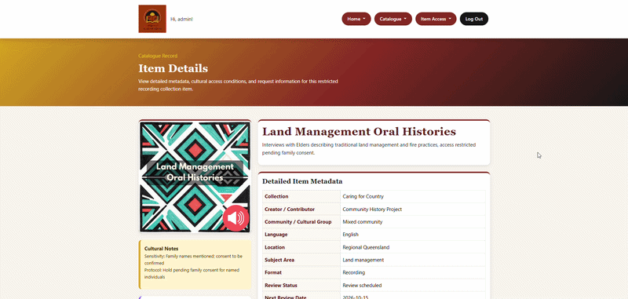

# Indigenous Cultural Collection Library

<!-- {add test badges here, all projects you build from here on out will have tests, therefore you should have github workflow badges at the top of your repositories: [Github Workflow Badges](https://docs.github.com/en/actions/monitoring-and-troubleshooting-workflows/adding-a-workflow-status-badge)} -->

A Flask web application for managing culturally-sensitive Indigenous artefacts within an Academic Library Collection. The build demonstrates core skills in front-end/back-end integration, authentication, validation, and a responsive, professional UI.

**_Techstack:_** Built with Flask (MVC structure), MySQL, session-based authentication, WTForms and Bootstrap 5. See [requirements](requirements.txt)

**_Main Purpose:_** Give an academic library a Flask-based web application for digitising, managing, and publishing its Indigenous collections online, with a database aligned their library records management model. It's designed to handle cultural material ethically via CARE principles by capturing metadata on sensitivity and access restrictions, and by gating public release of items until community elders and appropriate parties have reviewed and approved them. See [prd.md](docs/prd.md) for the complete project specification.

---

## Live Demo

> [**View Live Demo** ↗️](https://indigenous-library-ov0s.onrender.com/)

The demo of this project is deployed with Render (front-end) and Aiven (back-end). This is to keep deployment simple however in the future AWS S3 + EC2 with a load balancer can be used instead for future scaling.

### Preview Restricted Feature with Admin role



- **Try it**: click **"Try Demo as Admin"** on the [login page](https://indigenous-library-ov0s.onrender.com/auth/login) - no password required.
- **What you get**: full Admin access (roleID 1) - create/edit/delete collection items, manage access requests, everything a real Admin can do.
- **Data resets automatically**: since this is a shared account, all data resets to its original seed state every 10 minutes via a scheduled GitHub Action. Don't be surprised if your changes disappear shortly after - that's expected, not a bug.
- **Why**: this is a live public deployment, not a sandboxed per-visitor environment, so resets keep the demo clean for the next person and prevent the database from accumulating spam/junk input over time.

The client app has 3-4 main pages:

### Home/Catalogue Page

Browse collection items with dynamic search and filtering by category, cultural group, and access level. Displays item titles, images, descriptions, and access status (Public/Restricted/Under Review).


### Item Details Page

View full item metadata including cultural notes, description, and access status. Public users can submit access requests for restricted items. All forms include validation and error handling.



### Item Assessment Page

Restricted to authorized reviewers (Admin, Community Reviewer). View full item history, add discussion comments, update cultural metadata, and approve/reject access requests. All decisions are recorded with reviewer identity and timestamp.



---

## My Contributions

As part of a 5-person team, here are the following contributions I personally made:

- **Controller layer & authentication**:
  - Built the core authentication system (login, registration, logout, session management)
  - Implemented role-based access control with custom decorators to protect key routes
  - Converted all team members' view routes into the Flask blueprint pattern to integrate the codebase
  - Reconciled model/view inconsistencies (e.g. mismatched column and variable naming) across four contributors' code
  - Replaced hardcoded UI dummy data with live MySQL queries across the view layer

- **Item Details & Item Assessment pages**:
  - Developed dynamic, role-aware rendering of actions (request access, assessment, reviews)
  - Duplicate-request prevention
  - Comment/review decision handling
  - Audit tracking (status, reviewer, timestamps, history)
  - Cleaned up the UI to reduce redundant info and out of scope features

- **CRUD & workflow logic**:
  - Implemented database-driven status transitions (e.g., Pending → Public/Restricted)
  - Ensured all actions respected role permissions and workflow rules

- **Error handling & validation**:
  - Added custom validation and flash messaging across registration, login, reviews, and comments
  - Handling for SQL integrity errors and empty-result states

- **Deployment and CI/CD Pipeline**:
  - Full deployment of the live demo via Render and Aiven for mySQLdb hosting, with 'Login as Admin' feature in Demo Login page.
  - Implemented github action jobs to keep Aiven server alive on free tier and automated model test suite.

- **Collaboration**:
  - Cross-supported teammates on the View layer (SVG renaming) and Controller layer (access request submission)
  - Maintaining weekly/daily check-ins to keep implementation aligned with the project brief

---

## Challenges & Lessons Learned

- **Prioritizing MVP over polish, even in my own area of expertise.**
  UX/UI is my background, but I deliberately deferred styling decisions to a teammate and focused on getting the controller and auth layers fully working first. It reinforced that "working and secure" beats "polished" when time is the real constraint.

- **Merging four people's code into one controller layer, on a deadline.**
  As the controller developer I was blocked until the model and view layers landed in the final two weeks. I had to reconcile inconsistent variable/column naming across the OOP model, convert every teammate's routes into the blueprint pattern, and replace hardcoded template data with live MySQL queries. Next time I'd push for shared naming conventions much earlier in the build.

- **Manually verifying role-based access control.**
  Flask-Admin was off the table, so RBAC ran on custom decorators, tested by hand in-browser against every role to confirm public users couldn't reach restricted items, even via direct URL. Given more time, I'd build an automated test suite specifically for permission boundaries instead of relying on manual checks.

- **Ethical constraints shaped the data model, not just the UI.**
  Access control here isn't just "logged in or not". Items move through a cultural review workflow before release, which pushed access status into a real state machine (Pending → Open / Restricted / Culturally Sensitive) rather than a boolean flag.

- **Free-tier hosting meant trading polish for pragmatism.**
  Aiven was a good call to keep DB hosting simple, but free-tier cold starts and shutdowns needed a workaround - a scheduled GitHub Actions job to keep it alive, a deliberately "good enough for now" fix flagged in the roadmap.

---

## Features

Public users can browse a catalogue of collection items and submit access requests for restricted items. Only authorised users can review those requests through a cultural assessment workflow. Indigenous elders and community members can view/edit cultural metadata for all items and provide input on access requests via comments on the Item Assessment Page. Library Staff can add, delete and edit item data to keep the whole catalogue up to date.

| Feature                          | Description                                                                                       |
| -------------------------------- | ------------------------------------------------------------------------------------------------- |
| **Role-Based Access**            | Admin, Community Reviewer, Library Staff, and Public User roles with enforced permissions         |
| **Authentication**               | Registration, login/logout with hashed passwords and session management                           |
| **Browse & Search**              | Dynamically display collection items with filtering by category, cultural group, and access level |
| **Item Management**              | Full CRUD operations for collection items and metadata                                            |
| **Access Requests**              | Public users submit requests for restricted items; reviewers assess and approve/reject            |
| **Cultural Assessment Workflow** | Reviewers add comments, update metadata, and record decisions with audit trail                    |

> See [prd.md](docs/prd.md) for the complete assignment specification.
> See all user flows [here](docs/user-flows/README.md).
> See full list of CRUD endpoints / Flask routes and role permissions [here](project/README.md).

### Flagship Feature - Requesting Restricted Item Access

The most critical feature for meeting the client's ethical requirements: culturally sensitive items stay gated until a Community Reviewer or Admin has assessed them.

A Public User requests access to a restricted item, a reviewer evaluates it against cultural protocol and records an Approve/Reject decision, and the item's access status updates accordingly with the full decision and reviewer identity stored as an audit trail.


---

## Roadmap

What's next, and what's still rough. Grouped by priority.

### Known Issues

- Not all model tests are passing yet - see the [tests folder](tests/README.md) and [model-tests.yml](.github/workflows/model-tests.yml).
- Item card images take 10-30 seconds to render on the catalogue page.
- Item Assessment page is hard to reach from Item Details alone - needs a direct link.
- Minor responsiveness/UX polish outstanding (item card layout, redundant text).
- Demo deployment (Render + Aiven free tier) cold-starts after inactivity (~30-50s); a [keep-alive workflow](.github/workflows/keep-alive.yml) mitigates this but is still being tuned.

### Planned Next

- Let Admins assign roles to users (currently requires a direct database update).
- Add a 'Forgot Password' flow.
- Add a user profile / 'My Access Requests' page for Public Users.
- Add quick-access demo login toggles for each role (Public / Admin / Staff / Community Reviewer), not just Admin.

### Longer Term

- Migrate the live demo to AWS (EC2 + S3) for more stable hosting than the free-tier Render/Aiven setup.
- Add nav links from catalogue item cards straight to the Item Assessment page.

---

## Local Setup

### 1. Install prerequisites

> See [requirements](requirements.txt)

Install these once before you set anything up:

- **Python 3.12** (the team standard). Newer versions such as 3.14 can work, but may not have prebuilt packages on Windows yet, so 3.12 keeps installs simple for everyone.
- **MySQL Server** and **MySQL Workbench** (to create and load the database).
- **Git**, or **GitHub Desktop** if you prefer a visual tool.

### 2. Get the code

Clone the repository (GitHub Desktop: File, then Clone Repository, then choose Team01D), and check out the **main** branch. That branch holds the integrated, runnable app.

### 3. Create the database

Open `database.sql` in MySQL Workbench and run it (Execute All). This creates the `ifq582_a2` database and all its tables.

### 4. Set your database password

Copy `config.example.py` to `config.py` and put your own MySQL root password in it. `config.py` is gitignored, so your password never gets pushed.

- Windows: `copy config.example.py config.py`
- Mac or Linux: `cp config.example.py config.py`

### 5. Create a virtual environment and install the packages

From the repository root.

**Windows (PowerShell):**

```bash
python -m venv .venv
.venv\Scripts\activate # or source .venv/Scripts/activate
pip install -r requirements.txt
```

**Mac or Linux:**

```bash
python3 -m venv .venv
source .venv/bin/activate
pip install -r requirements.txt
```

**A note on `mysqlclient`:**

- On **Windows** (Python 3.12), pip installs a prebuilt package. Nothing extra is needed.
- On **Mac**, it compiles from source, so run `brew install mysql pkg-config` first, then the `pip install` above.

### 6. Run the app

```bash
python run.py

```

Open the address it prints, usually `http://127.0.0.1:5000`.

To stop the server, press `Ctrl + C` in the terminal.

### 7. Running the model test

A quick check that the database connection and `User.create` work:

```bash
python test_create_only.py
```

or

```bash
source .venv/bin/activate
python test_create_only.py
```

### 8. Access Test accounts with different role permissions

Refer to [here](db/README.md) for details.

---

## Project Directory

```
run.py              App entry point
requirements.txt    Python packages the app needs
config.example.py   Template for your local MySQL password
config.py           Your real password (gitignored, never pushed)

project/                Main application package
  db/
    database.sql          MySQL build script (run this in Workbench)
    unhash.sql            Unhashes seeded passwords for testing other roles
  static/                 CSS and images
  templates/              Jinja templates
  __init__.py             create_app() and the shared mysql object
  assessment.py           Cultural assessment workflow logic
  auth.py                 Register, login, logout, demo admin login
  decorators.py           Custom decorators for authentication and authorization
  forms.py                WTForms form classes
  maintenance.py          Secret-protected /admin/reset-demo endpoint (demo only)
  model.py                Data model: classes and data-access methods
  reset.py                Truncates and reseeds demo-writable tables (demo only)
  views.py                Page routes (home, catalogue, item details, and so on)

tests/                   Test suite

```

---

## Other Documentation Links

- [Database Schema](database/README.md)
- [Product Requirement Document](docs/prd.md)
- [Flask Routes and Role Permissions](project/README.md)

---

## Team Contribution

Big thanks to the development team:

- Model layer - Daniel Green, Brad Jackson
- View layer - Lona Ulsame, Carrie Gale
- Controller layer - Carrie Gale, Rebecca Llewelyn
- Demo Deployment - Carrie Gale

---

## License

MIT.
