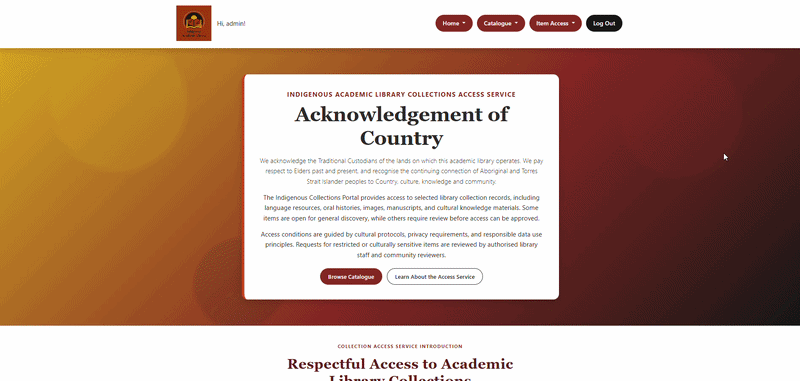

# Indigenous Cultural Collection Library

A Flask web application for managing culturally-sensitive Indigenous artefacts within an Academic Library Collection. Built with Flask (MVC structure), MySQL, session-based authentication, WTForms and Bootstrap 5. Demo deployed with Render (front-end) and Avien (back-end).

**_Main Features:_** Public users can browse a catalogue of collection items and submit access requests for restricted items. Only authorised users can review those requests through a cultural assessment workflow or view/edit cultural metadata for all items.

## Demo Mode

> [**View Live Demo** ↗️](https://indigenous-library-ov0s.onrender.com/)

- **Try it**: click **"Try Demo as Admin"** on the [login page](https://indigenous-library-ov0s.onrender.com/auth/login) — no password required.
- **What you get**: full Admin access (roleID 1) — create/edit/delete collection items, manage access requests, everything a real Admin can do.
- **Data resets automatically**: since this is a shared account, all data resets to its original seed state every 10 minutes via a scheduled GitHub Action. Don't be surprised if your changes disappear shortly after — that's expected, not a bug.
- **Why**: this is a live public deployment, not a sandboxed per-visitor environment, so resets keep the demo clean for the next person and prevent the database from accumulating spam/junk input over time.

Implementation: [`project/reset.py`](project/reset.py) truncates and reseeds demo-writable tables, exposed via a secret-protected endpoint in [`project/maintenance.py`](project/maintenance.py), triggered on a schedule by [`.github/workflows/reset-demo.yml`](.github/workflows/reset-demo.yml).

## Local Setup

### 1. Install prerequisites

> See [requirements](requirements.txt)

Install these once before you set anything up:

- **Python 3.12** (the team standard). Newer versions such as 3.14 can work, but may not have prebuilt packages on Windows yet, so 3.12 keeps installs simple for everyone.
- **MySQL Server** and **MySQL Workbench** (to create and load the database).
- **Git**, or **GitHub Desktop** if you prefer a visual tool.

### 2. Get the code

Clone the repository (GitHub Desktop: File, then Clone Repository, then choose Team01D), and check out the **main** branch. That branch holds the integrated, runnable app.

### 2. Create the database

Open `database.sql` in MySQL Workbench and run it (Execute All). This creates the `ifq582_a2` database and all its tables.

### 3. Set your database password

Copy `config.example.py` to `config.py` and put your own MySQL root password in it. `config.py` is gitignored, so your password never gets pushed.

- Windows: `copy config.example.py config.py`
- Mac or Linux: `cp config.example.py config.py`

### 4. Create a virtual environment and install the packages

From the repository root.

**Windows (PowerShell):**

```bash
python -m venv .venv
.venv\Scripts\activate # or source .venv/Scripts/activate
pip install -r requirements.txt
```

**Mac or Linux:**

```bash
python3 -m venv .venv
source .venv/bin/activate
pip install -r requirements.txt
```

**A note on `mysqlclient`:**

- On **Windows** (Python 3.12), pip installs a prebuilt package. Nothing extra is needed.
- On **Mac**, it compiles from source, so run `brew install mysql pkg-config` first, then the `pip install` above.

### 5. Run the app

```bash
python run.py

```

Open the address it prints, usually `http://127.0.0.1:5000`.

To stop the server, press `Ctrl + C` in the terminal.

### 6. Running the model test

A quick check that the database connection and `User.create` work:

```bash
python test_create_only.py
```

or

```bash
source .venv/bin/activate
python test_create_only.py
```

### 7. Access Admin/Community Reviewer/Library Staff accounts

The registration feature defaults to making a public user account only.
To access features with different role permissions, you can unhash passwords from user accounts in your local `database.sql` in MySQL Workbench.

In MySQL Workbench:

1. Open Workbench and connect to your local instance (same one python run.py connects to).
2. In the schema navigator on the left, make sure ifq582_a2 is set as the active schema, double-click it if it's not bolded/selected, that's what points a new query at the right database.
3. Open a new SQL tab (the little page icon, or File > New Query Tab).
4. Paste this UPDATE statement in (or run `unhash.sql`).

```sql
UPDATE User
-- Hash for 'Pass1234'
SET passwordHash = 'scrypt:32768:8:1$IHBREYqzuKD0jk4z$6d39174c27e44379d0991d57503aa991f0871fac6e7213feb9d913e723c9bdfd9bd81bbbcce46a583addc70d786d6230a00d08f7c6884ec7dd8f79e1b7e7e448'
WHERE userID > 0; -- all accounts in db, change to `WHERE userID = <int>` for specific user
```

5. Run it, either the lightning bolt icon in the toolbar or Cmd+Return with your cursor on that line.Workbench will report something like "8 row(s) affected" in the output panel at the bottom, that's your confirmation all 8 seeded users got the new hash.
6. You should now be able to login to all accounts with the password 'Pass1234'.
7. To reverse these change, just re-run `database.sql` in MySql to reinitialise the database.

---

## Project Overview

### Main Pages

#### Home/Catalogue Page

Browse collection items with dynamic search and filtering by category, cultural group, and access level. Displays item titles, images, descriptions, and access status (Public/Restricted/Under Review).



#### Item Details Page

View full item metadata including cultural notes, description, and access status. Public users can submit access requests for restricted items. All forms include validation and error handling.


#### Item Assessment Page

Restricted to authorized reviewers (Admin, Community Reviewer). View full item history, add discussion comments, update cultural metadata, and approve/reject access requests. All decisions are recorded with reviewer identity and timestamp.


### Main Features

| Feature                          | Description                                                                                       |
| -------------------------------- | ------------------------------------------------------------------------------------------------- |
| **Browse & Search**              | Dynamically display collection items with filtering by category, cultural group, and access level |
| **Role-Based Access**            | Admin, Community Reviewer, Library Staff, and Public User roles with enforced permissions         |
| **Access Requests**              | Public users submit requests for restricted items; reviewers assess and approve/reject            |
| **Cultural Assessment Workflow** | Reviewers add comments, update metadata, and record decisions with audit trail                    |
| **Item Management**              | Full CRUD operations for collection items and metadata                                            |
| **Authentication**               | Registration, login/logout with hashed passwords and session management                           |
| **Responsive UI**                | Bootstrap 5.3 with custom CSS across desktop, tablet, and mobile                                  |
| **Error Handling**               | Custom error pages (404, 500) via error.html template                                             |
| **Database**                     | Pre-populated MySQL database with 15+ items, 6+ users, and review decisions                       |

> See [requirements.md](requirements.md) for the complete assignment specification.

### Access Request Workflow

1. **Public User submits request** → Views restricted item and clicks "Request Access"
2. **Item transitions** → Access status changes to "Under Review"
3. **Reviewer assesses** → Community Reviewer/Admin reviews item and comments on cultural appropriateness
4. **Decision recorded** → Reviewer approves or rejects with documented reasoning
5. **Status updated** → Item access level changes to Public (approved) or remains Restricted (rejected)
6. **Audit trail maintained** → All decisions stored in database with timestamp and reviewer details

### Role Permissions

| Role                   | Permissions                                                                                                                                         |
| ---------------------- | --------------------------------------------------------------------------------------------------------------------------------------------------- |
| **Admin**              | Full system access • Create/edit/delete items • Assign user roles • View & manage all requests • Approve/reject access • Modify metadata            |
| **Community Reviewer** | View items under review • Add discussion comments • Approve/reject access requests • Update cultural metadata • Cannot delete items or manage users |
| **Library Staff**      | Create & edit collection items • Upload images and metadata • View access requests • Cannot finalize decisions unless assigned reviewer role        |
| **Public User**        | Browse public items • View item details • Submit access requests for restricted items • Cannot edit items or access assessment pages                |

### CRUD Endpoints

#### **Home & Browsing**

| Endpoint          | Description                                                              | Access Level |
| ----------------- | ------------------------------------------------------------------------ | ------------ |
| `/`               | Home page with featured items                                            | Public       |
| `/catalogue`      | Browse all items with search and filtering by category, type, and status | Public       |
| `/access-privacy` | Access and privacy notice                                                | Public       |
| `/auth/register`  | User registration                                                        | Public       |
| `/auth/login`     | User login                                                               | Public       |
| `/auth/logout`    | User logout                                                              | Logged-in    |

#### **Item Management**

| Endpoint               | Description                    | Access Level         |
| ---------------------- | ------------------------------ | -------------------- |
| `/item-details/<id>`   | View item details and metadata | Public               |
| `/items/<id>/edit`     | Edit item details              | Admin, Library Staff |
| `/items/<id>/delete`   | Delete item                    | Admin                |
| `/items/<id>/metadata` | Update cultural metadata       | Reviewers, Admin     |

#### **Access Requests & Assessment**

| Endpoint                                  | Description                                | Access Level                    |
| ----------------------------------------- | ------------------------------------------ | ------------------------------- |
| `/items/<id>/request`                     | Submit access request for restricted items | Logged-in                       |
| `/items/assessment/<id>`                  | View and assess item with pending requests | Reviewers, Admin, Library Staff |
| `/items/assessment/<request_id>/comment`  | Add discussion comment to request          | Reviewers, Admin                |
| `/items/assessment/<request_id>/decision` | Record approval/rejection decision         | Reviewers, Admin                |

#### **Demo-Only Endpoints**

| Endpoint            | Description                                                            | Access Level                      |
| ------------------- | ---------------------------------------------------------------------- | --------------------------------- |
| `/auth/demo-login`  | One-click login as the shared demo admin account, no password required | Public                            |
| `/admin/reset-demo` | Truncates and reseeds demo-writable tables back to the original state  | Secret key (`X-Reset-Key` header) |

### Database Schema

> See `database.sql` and [EER diagram](database/EER_diagram.pdf)
> To run model tests, see [tests folder](tests/README.md)

| Table                | Primary Key  | Foreign Keys                                       | Purpose                                                                                         |
| -------------------- | ------------ | -------------------------------------------------- | ----------------------------------------------------------------------------------------------- |
| **Role**             | roleID       | —                                                  | Stores user roles (Admin, Community Reviewer, Library Staff, Public User)                       |
| **User**             | userID       | roleID → Role                                      | Stores user accounts with credentials, roles, and account status                                |
| **Collection**       | collectionID | —                                                  | Organizes collection items into themed groups (Languages, Oral History, Art, etc.)              |
| **CollectionItem**   | itemID       | collectionID → Collection, statusID → AccessStatus | Stores the main collection items with metadata like title, author, year, item type              |
| **AccessStatus**     | statusID     | —                                                  | Defines access levels (Open, Restricted, Culturally Sensitive)                                  |
| **CulturalMetadata** | metadataID   | itemID → CollectionItem (1:1)                      | Stores cultural information for items (community group, language, sensitivity notes, protocols) |
| **AccessRequest**    | requestID    | userID → User, itemID → CollectionItem             | Records user requests for restricted item access with reason and supporting documents           |
| **ReviewDecision**   | decisionID   | requestID → AccessRequest, reviewerID → User       | Records reviewer decisions (Approved/Rejected) with reasoning and access conditions             |
| **CommunityComment** | commentID    | requestID → AccessRequest, reviewerID → User       | Stores discussion comments from reviewers during the assessment workflow                        |

## Project layout

```
run.py              App entry point
requirements.txt    Python packages the app needs
database.sql        MySQL build script (run this in Workbench)
config.example.py   Template for your local MySQL password
config.py           Your real password (gitignored, never pushed)

.github/
  workflows/
    reset-demo.yml  Scheduled job that triggers the demo data reset

project/            Main application package
  __init__.py       create_app() and the shared mysql object
  model.py          Data model: classes and data-access methods
  views.py          Page routes (home, catalogue, item details, and so on)
  auth.py           Register, login, logout, demo admin login
  forms.py          WTForms form classes
  assessment.py     Cultural assessment workflow logic
  decorators.py     Custom decorators for authentication and authorization
  reset.py          Truncates and reseeds demo-writable tables (demo only)
  maintenance.py    Secret-protected /admin/reset-demo endpoint (demo only)
  templates/        Jinja templates
  static/           CSS and images
    styles.css
    assets/

tests/              Test suite

```

## Team Contribution

Thanks to the team:

- Model layer - Daniel Green, Brad Jackson
- View layer - Lona Ulsame, Carrie Gale
- Controller layer - Carrie Gale, Rebecca Llewelyn
- Demo Deployment - Carrie Gale

## License

MIT.
