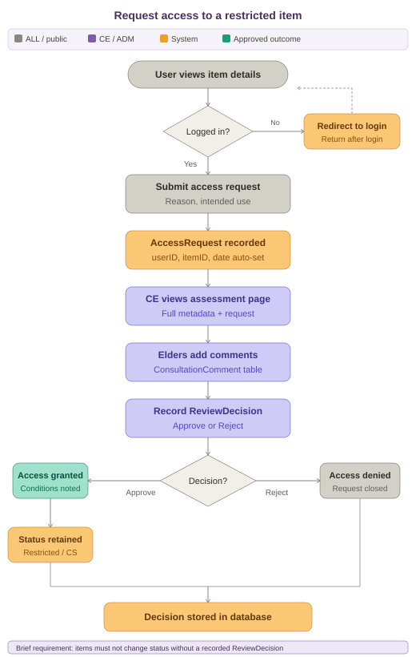

# Indigenous Cultural Collection Library

<!-- {add test badges here, all projects you build from here on out will have tests, therefore you should have github workflow badges at the top of your repositories: [Github Workflow Badges](https://docs.github.com/en/actions/monitoring-and-troubleshooting-workflows/adding-a-workflow-status-badge)} -->

A Flask web application for managing culturally-sensitive Indigenous artefacts within an Academic Library Collection. The build demonstrates core skills in front-end/back-end integration, authentication, validation, and a responsive, professional UI.

**_Techstack:_** Built with Flask (MVC structure), MySQL, session-based authentication, WTForms and Bootstrap 5. See [requirements](requirements.txt)

**_Main Purpose:_** Give an academic library a Flask-based web application for digitising, managing, and publishing its Indigenous collections online, with a database aligned their library records management model. It's designed to handle cultural material ethically via CARE principles by capturing metadata on sensitivity and access restrictions, and by gating public release of items until community elders and appropriate parties have reviewed and approved them. See [prd.md](prd.md) for the complete project specification.

---

## Demo & Snippets

> [**View Live Demo** ↗️](https://indigenous-library-ov0s.onrender.com/)

The demo of this project is deployed with Render (front-end) and Avien (back-end). This is to keep deployment simple however in the future AWS S3 + EC2 with a load balancer can be used instead for future scaling.

### Preview Restricted Feature with Admin role


- **Try it**: click **"Try Demo as Admin"** on the [login page](https://indigenous-library-ov0s.onrender.com/auth/login) — no password required.
- **What you get**: full Admin access (roleID 1) — create/edit/delete collection items, manage access requests, everything a real Admin can do.
- **Data resets automatically**: since this is a shared account, all data resets to its original seed state every 10 minutes via a scheduled GitHub Action. Don't be surprised if your changes disappear shortly after — that's expected, not a bug.
- **Why**: this is a live public deployment, not a sandboxed per-visitor environment, so resets keep the demo clean for the next person and prevent the database from accumulating spam/junk input over time.

The client app has 3-4 main pages:

### Home/Catalogue Page

Browse collection items with dynamic search and filtering by category, cultural group, and access level. Displays item titles, images, descriptions, and access status (Public/Restricted/Under Review).


### Item Details Page

View full item metadata including cultural notes, description, and access status. Public users can submit access requests for restricted items. All forms include validation and error handling.


### Item Assessment Page

Restricted to authorized reviewers (Admin, Community Reviewer). View full item history, add discussion comments, update cultural metadata, and approve/reject access requests. All decisions are recorded with reviewer identity and timestamp.


---

## Local Setup

### 1. Install prerequisites

> See [requirements](requirements.txt)

Install these once before you set anything up:

- **Python 3.12** (the team standard). Newer versions such as 3.14 can work, but may not have prebuilt packages on Windows yet, so 3.12 keeps installs simple for everyone.
- **MySQL Server** and **MySQL Workbench** (to create and load the database).
- **Git**, or **GitHub Desktop** if you prefer a visual tool.

### 2. Get the code

Clone the repository (GitHub Desktop: File, then Clone Repository, then choose Team01D), and check out the **main** branch. That branch holds the integrated, runnable app.

### 2. Create the database

Open `database.sql` in MySQL Workbench and run it (Execute All). This creates the `ifq582_a2` database and all its tables.

### 3. Set your database password

Copy `config.example.py` to `config.py` and put your own MySQL root password in it. `config.py` is gitignored, so your password never gets pushed.

- Windows: `copy config.example.py config.py`
- Mac or Linux: `cp config.example.py config.py`

### 4. Create a virtual environment and install the packages

From the repository root.

**Windows (PowerShell):**

```bash
python -m venv .venv
.venv\Scripts\activate # or source .venv/Scripts/activate
pip install -r requirements.txt
```

**Mac or Linux:**

```bash
python3 -m venv .venv
source .venv/bin/activate
pip install -r requirements.txt
```

**A note on `mysqlclient`:**

- On **Windows** (Python 3.12), pip installs a prebuilt package. Nothing extra is needed.
- On **Mac**, it compiles from source, so run `brew install mysql pkg-config` first, then the `pip install` above.

### 5. Run the app

```bash
python run.py

```

Open the address it prints, usually `http://127.0.0.1:5000`.

To stop the server, press `Ctrl + C` in the terminal.

### 6. Running the model test

A quick check that the database connection and `User.create` work:

```bash
python test_create_only.py
```

or

```bash
source .venv/bin/activate
python test_create_only.py
```

### 7. Access Admin/Community Reviewer/Library Staff accounts

The registration feature defaults to making a public user account only.
To access features with different role permissions, you can unhash passwords from user accounts in your local `database.sql` in MySQL Workbench.

In MySQL Workbench:

1. Open Workbench and connect to your local instance (same one python run.py connects to).
2. In the schema navigator on the left, make sure ifq582_a2 is set as the active schema, double-click it if it's not bolded/selected, that's what points a new query at the right database.
3. Open a new SQL tab (the little page icon, or File > New Query Tab).
4. Paste this UPDATE statement in (or run `unhash.sql`).

```sql
UPDATE User
-- Hash for 'Pass1234'
SET passwordHash = 'scrypt:32768:8:1$IHBREYqzuKD0jk4z$6d39174c27e44379d0991d57503aa991f0871fac6e7213feb9d913e723c9bdfd9bd81bbbcce46a583addc70d786d6230a00d08f7c6884ec7dd8f79e1b7e7e448'
WHERE userID > 0; -- all accounts in db, change to `WHERE userID = <int>` for specific user
```

5. Run it, either the lightning bolt icon in the toolbar or Cmd+Return with your cursor on that line.Workbench will report something like "8 row(s) affected" in the output panel at the bottom, that's your confirmation all 8 seeded users got the new hash.
6. You should now be able to login to all accounts with the password 'Pass1234'.
7. To reverse these change, just re-run `database.sql` in MySql to reinitialise the database.

---

## Main Features

Public users can browse a catalogue of collection items and submit access requests for restricted items. Only authorised users can review those requests through a cultural assessment workflow. Indigenous elders and community members can view/edit cultural metadata for all items and provide input on access requests via comments on the Item Assessment Page. Library Staff can add, delete and edit item data to keep the whole catalogue up to date.

| Feature                          | Description                                                                                       |
| -------------------------------- | ------------------------------------------------------------------------------------------------- |
| **Role-Based Access**            | Admin, Community Reviewer, Library Staff, and Public User roles with enforced permissions         |
| **Authentication**               | Registration, login/logout with hashed passwords and session management                           |
| **Browse & Search**              | Dynamically display collection items with filtering by category, cultural group, and access level |
| **Item Management**              | Full CRUD operations for collection items and metadata                                            |
| **Access Requests**              | Public users submit requests for restricted items; reviewers assess and approve/reject            |
| **Cultural Assessment Workflow** | Reviewers add comments, update metadata, and record decisions with audit trail                    |

> See [prd.md](prd.md) for the complete assignment specification.
> See full list of CRUD endpoints / Flask routes and role permissions [here](project/README.md).

## Request Access Feature

_Purpose:_ The library also plans to engage with community elders in order to assess the collections and receive community input on how the data is to be managed. The web application must, therefore, limit access to collections until appropriate parties have determined that a particular item in the collection can be publicly released or kept private. This is the most critical feature to meet client requirements.

1. **Public User submits request** → Views restricted item and clicks "Request Access"
2. **Item transitions** → Access status changes to "Under Review"
3. **Reviewer assesses** → Community Reviewer/Admin reviews item and comments on cultural appropriateness
4. **Decision recorded** → Reviewer approves or rejects with documented reasoning
5. **Status updated** → Item access level changes to Public (approved) or remains Restricted (rejected)
6. **Audit trail maintained** → All decisions stored in database with timestamp and reviewer details



> See all user flows [here](user-flows/README.md).

---

<!-- ## Design Decisions & Challenges -->

## My Contributions

As part of a 5-person team, here are the following contributions I made:

- **Controller layer & authentication**:
  - Built the core authentication system (login, registration, logout, session management)
  - Implemented role-based access control with custom decorators to protect key routes

- **Item Details & Item Assessment pages**:
  - Developed dynamic, role-aware rendering of actions (request access, assessment, reviews)
  - Duplicate-request prevention
  - Comment/review decision handling
  - Audit tracking (status, reviewer, timestamps, history)

- **CRUD & workflow logic**:
  - Implemented database-driven status transitions (e.g., Pending → Public/Restricted)
  - Ensured all actions respected role permissions and workflow rules

- **Error handling & validation**:
  - Added custom validation and flash messaging across registration, login, reviews, and comments
  - Handling for SQL integrity errors and empty-result states

- **Collaboration**:
  - Cross-supported teammates on the View layer (SVG renaming, blueprint conversion) and Controller layer (access request submission)
  - Maintaining weekly/daily check-ins to keep implementation aligned with the project brief

- **Deployment and CI/CD Pipeline**:
  - Full deployment of the live demo via Render and Avien for mySQLdb hosting, with 'Login as Admin' feature in Demo Login page.
  - Implemented github action jobs to keep Avien server alive on free tier and automated model test suite.

---

## Known issues

<!-- - Features that are buggy / flimsy -->

- Some responsiveness and UX/UI issues may exist from the html jinja templates used.

<!-- - Remaining bugs, things that have been left unfixed -->

- Although deployed with Render and Avien for simplicity, these servers/instances automatically shutdown after a period of inactivity. A Github Actions workflow has been implemented as a temporary fix. See [keep-alive.yml](.github/workflows/keep-alive.yml).

---

## Future Goals

<!-- - What are the immediate features you'd add given more time -->

- Allow Admin to assign role permissions to users.
- Implement a 'Forgot Password' feature for Login Page.
- User profile page and 'My Access Requests' page for Public users.
- Migrate live demo server to AWS EC2/S3 for stability.

---

## Project Directory

```
run.py              App entry point
requirements.txt    Python packages the app needs
database.sql        MySQL build script (run this in Workbench)
config.example.py   Template for your local MySQL password
config.py           Your real password (gitignored, never pushed)

.github/
  workflows/
    reset-demo.yml  Scheduled job that triggers the demo data reset
    keep-alive.yml  Scheduled job to keep Avien mySQLdb server running

project/            Main application package
  __init__.py       create_app() and the shared mysql object
  model.py          Data model: classes and data-access methods
  views.py          Page routes (home, catalogue, item details, and so on)
  auth.py           Register, login, logout, demo admin login
  forms.py          WTForms form classes
  assessment.py     Cultural assessment workflow logic
  decorators.py     Custom decorators for authentication and authorization
  reset.py          Truncates and reseeds demo-writable tables (demo only)
  maintenance.py    Secret-protected /admin/reset-demo endpoint (demo only)
  templates/        Jinja templates
  static/           CSS and images
    styles.css
    assets/

tests/              Test suite

```

---

### More Documentation Links

- [Database Schema](database/README.md)
- [Product Requirement Document](prd.md)
- [Flask Routes and Role Permissions](project/README.md)

---

## Team Contribution

Big thanks to the development team:

- Model layer - Daniel Green, Brad Jackson
- View layer - Lona Ulsame, Carrie Gale
- Controller layer - Carrie Gale, Rebecca Llewelyn
- Demo Deployment - Carrie Gale

---

## License

MIT.
