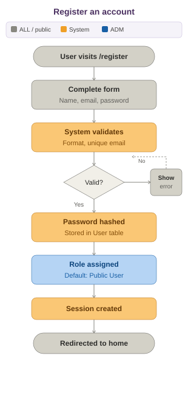
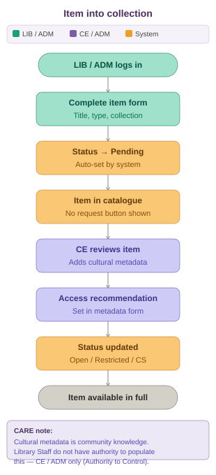

# User Flows

## Registration

## Item into Collection

## Request Access

1. **Public User submits request** → Views restricted item and clicks "Request Access"
2. **Item transitions** → Access status changes to "Under Review"
3. **Reviewer assesses** → Community Reviewer/Admin reviews item and comments on cultural appropriateness
4. **Decision recorded** → Reviewer approves or rejects with documented reasoning
5. **Status updated** → Item access level changes to Public (approved) or remains Restricted (rejected)
6. **Audit trail maintained** → All decisions stored in database with timestamp and reviewer details

